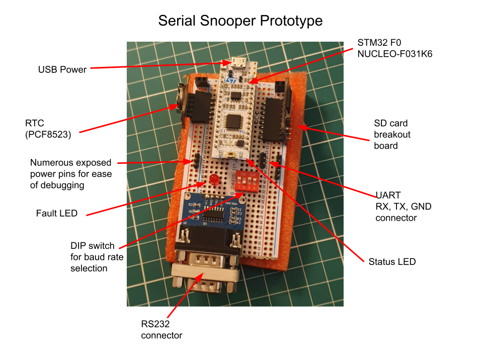

# Serial Snooper

The Serial Snooper is a UART data logger with automatic baud rate detection, real-time data stamping and a command-line-interface for configuration, running on an STM32F3 microcontroller.

It is utilised in an R&D setting to easily capture logs from devices to speed up catching software and hardware bugs.

<i> This project started out as a submission for the final project in the course "Making Embedded Systems" by Elecia White, and evolved into a complete functional product used professionally. The report for the project submitted to the course can be found [here](https://docs.google.com/document/d/1QN5CVr99LwbAlFGOjgETou2btL8RMqJVu_yTGeXLMHs/edit?usp=sharing). </i>

## The Final Product

<image src="resource\hw_image_1.jpg">
<i>PCBA Front</i>
 
 
<image src="resource\hw_image_2.jpg">
<i>PCBA Back</i>
 
 

## Description of Operation

1. Plug in USB (5V - resettable fuse limits current to 500mA incase of short circuits damaging the power source).
2. Device powers up, indicated by the green LED.
3. A short moment later, the red LED lights up, indicating that the SD card was successfully initialised.
4. Plug in DB9 cable for the device you wish to snoop. The baud rate will be automatically detected.
5. The yellow LED will toggle for every character received.
6. The blue LED will toggle for every successful SD card write.
7. When ready, power down the device by removing the USB cable and remove the SD card.

## Schematic

<image src="HardwareDesign\hardwareImages_v1\schematic_png.PNG">
<i>Partial schematic. At the heart of the device is a STM32F303 microcontroller.</i>

 

The full hardware schematic can be found on [Github](HardwareDesign/hardwareImages_v1/serial_snooper_schematic.pdf).

## Design Block Diagram

<i>Software Block Diagram</i>

## Prototype

A prototype board was created to aid development.

Headers have been soldered to a perforated board. A mixture of wire wrapping and soldering used for the connections.

### The working prototype

### Pinouts

# Demo 

All demonstrations below are from the prototype device using the software in this repository.

## Command Line Interface (CLI)

The CLI is used to:

- Ascertain the software version number
- Send commands:
  - Get DIP switch setting.
  - Get the current time.
  - Set the current time.

For example:

## Example Data Saved on SD Card

The received data is timestamped and saved to the SD card. The filesystem being used is Fatfs (middleware software for this was provided by STM32 Cube).

In the example below, nearly 30,000 characters were sent over the course of 68 seconds (at 115200 BR) and all data was transferred successfully.

*(The text file below is generated by the Serial Snooper and can be found as resource/example_log.TXT)*

