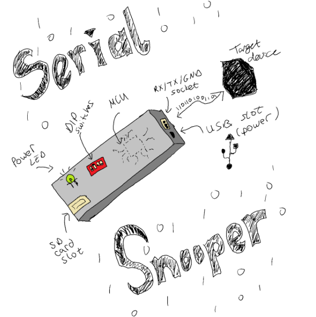

# Serial Snooper

The Serial Snooper is a UART data logger with a configurable baud rate, real time data stamping and a command-line-interface for user interaction.

This is my submission for the final project in the course Making Embedded Systems by Elecia White.

Final report for the project can be found <a ref="https://docs.google.com/document/d/1QN5CVr99LwbAlFGOjgETou2btL8RMqJVu_yTGeXLMHs/edit?usp=sharing">here (currently a draft version)</a>.

## Block Diagram

*Please see the report linked above for more information on the software architecture and design.*

<i>Software Block Diagram</i>

## Prototype

A prototype board has been created to aid the software development. 

Headers have been soldered to a perforated board. A mixture of wire wrapping and soldering used for the connections.

### The working prototype

### Pinouts

## Baud Rate Settings

|DIP Switch Value|Baud Rate|
|:-:|:-:|
|0| CLI (19,200) |
|1|110|
|2|300|
|3|600|
|4|1,200|
|5|2,400|
|6|4,800|
|7|9,600|
|8|14,400|
|9|19,200|
|10|38,400|
|11|57,600|
|12|76,800|
|13|115,200|
|14|230,400|
|15|460,800|

# Demo 

All demonstrations below are from the prototype device using the software in this repository.

## Command Line Interface (CLI)

The CLI is used to:

- Ascertain the software version number
- Send commands:
  - Confirm baud rate configuration
  - Get the current time
  - Set the current time

For example:

## Example Data Saved on SD Card

The received data is timestamped and saved to the SD card. The filesystem being used is Fatfs (middleware software for this was provided by STM32 Cube).

In the example below, nearly 30,000 characters were sent over the course of 68 seconds (at 115200 BR) and all data was transferred successfully.

However, transferring at faster rates than this causes loss of data. This is because writing to the the SD card is far slower than the UART can receive (e.g. ~77kBps vs UART 115kBps).

The next step in this project is to find a way to bring the loss of data down to as close to 0% as possible. A solution being considered is to use a SPI FRAM to buffer the data.

*(The text file below is generated by the Serial Snooper and can be found as resource/example_log.TXT)*

